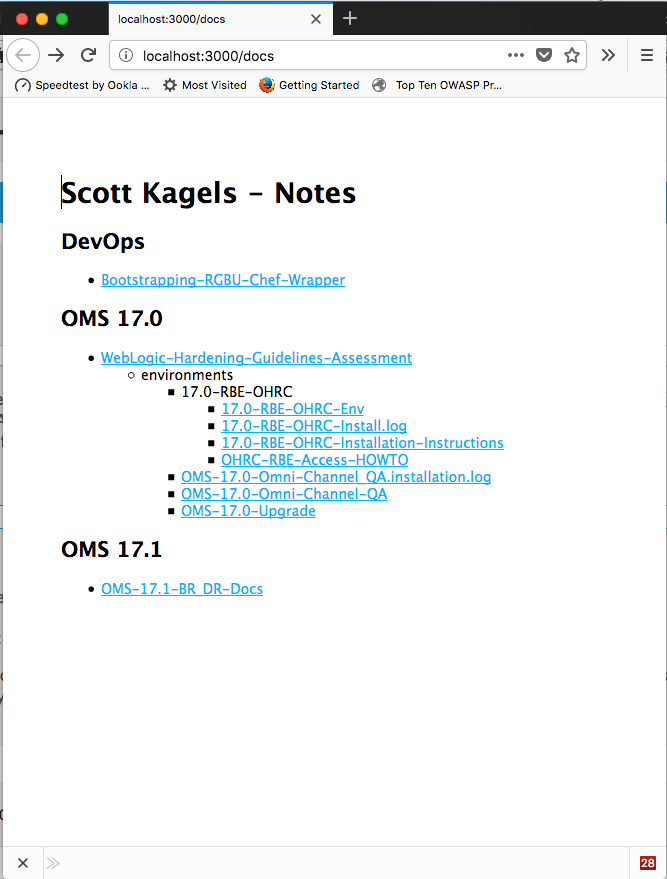

# Notes Site, Scott Kagels

## Summary
This node.js app is just a simple markdown viewer of personal notes that I keep elsewhere. I actually keep my notes in a directory that is synced with Oracle Content Cloud. However, Oracle Content Cloud doesn't currently render markdown.

## Setup
I setup the node project by updating brew and performing some other prerequisites for my MacOS High Sierra environment.


    brew update
    xcode-select --install
    brew install icu4c

Next, I upgraded node to the latest version and installed Express.

    brew upgrade node
    npm -g install -g express
    npm install -g express
    npm install express-generator -g

I then created the Express project, notesjs, and installed support for serving markdown documents:

    express notesjs
    npm install markdown-serve

## Serving Markdown

I created a soft link to the root of my documents so that the nodejs server could serve them:

    ln -s <path-to-oracle-content-sync-folder> Docs

## Wiring Up The App For Markdown Support

** app.js - line 6 **

      var mds = require('markdown-serve');

** app.js - lines 16-24 ** - Configure markdown view for all paths under /docs
      // view engine setup
      app.set('views', path.join(__dirname, 'views'));
      app.set('view engine', 'jade');

      app.use('/docs', mds.middleware({
        rootDirectory: path.resolve(__dirname, 'docs'),
        view: 'markdown',
        preParse: true
      }));

** app.js - lines 24-27 ** - Set default doc for docs/

      app.get('/docs', function(req, res){
        res.sendfile('/docs/index');
      });

** views/markdown.jade ** - Jade template for markdown documents

```
// example views/markdown.jade (as referenced by view parameter above):

extends layout

block content    
    #content
        != markdownFile.parseContent()
```


## Start 'Er Up
I created a startup script for convenience:

    echo "DEBUG=notesjs:* npm start" > notes-start
    chmod +x notes-start

Finally, I started up the server:

    ./notes-start

And pointed my browser to:

http://localhost:3000/notes/index


## Voila!!!

